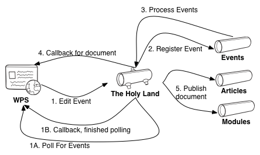
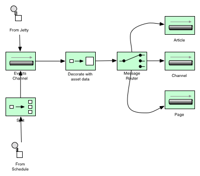
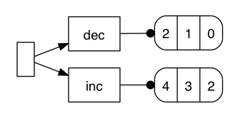
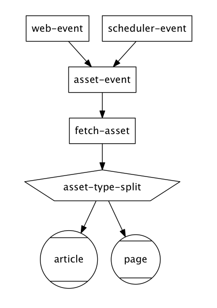

# Introduction #

# Areas of Interest #

* Systems Integration
* Business Rules Capture
* Distributed Systems Orchestration

# Enterprise Integration Patterns #

* Tech bookshelf mainstay
* A collection of patterns (like Go4)
* They capture transitions and interactions at a micro-level
* It's incredibly boring
* Powerful languages can render patterns obsolete
* Hopefully you can follow without having read this

# Case Study #

* Low throughput (< 5 messages a second) at peak
* Resistant to change
* A replacement for an existing system
* One-way flow
* Delivery is critical

# Component View #

# EIP View #

# Pattern Analysis #

* Message
* Message Channel
* Message Broker
* Message Router
* Content Enricher
* Pipeline
* Splitter
* Aggregator
* Dead Letter Channel

# The Products #

* MuleSoft Mule
* Apache Camel (HolyGrail)
* Lamina
* Clojure EEP
* Esper
* Twitter Storm
* Honourable Mentions 
  * core.async 
  * pipeseq 
  * pipejine 
  * Pedestal 
  * Conduit 
  * ClamQ

## Mule #

* No-one understood it
* No-one wanted to understand it
* It was breaking
* No replacement for a proper ESB in Clojure space that we know of

# Apache Camel (HolyGrail) #

* Designed to satisfy the EIPs
# Apache Camel: Systems Integration #
* Lot's of adaptors
* It will satisfy most message brokers
* Has a number of built-in adaptors for HTTP send/receive, file system etc

# Apache Camel: Business rules capture #
* Not bad
* HolyGrail transforms method chaining DSL into clojure like syntax
* HolyGrail DSL is homoiconic so you can build visualisations on top of it
* No killer visualisation without a spring configuration

# Apache Camel: Distributed Systems orchestration #
* Message
  * MessageInterface
* Message Channel
  * nice, initialised from URLs
* Message Broker
  * required for distributed operation
* Message Router
  * via when construct
* Content Enricher
  * via custom processor
* Pipeline
  * default behaviour of the DSL
* Splitter
  * via split construct
* Aggregator
  * Not shown, not suitable for this case
* Dead Letter Channel
  * error handler comes for free
  * bit hard to modify, customize

# Lamina #
* An elegant approach using idiomatic clojure
* Leverages the power of clojure.core rather than adherance to patterns
* Well documented, seems like a strong community

# Lamina: System Integration #
* You're on your own
* I've used clamq, compojure and quartzite

# Lamina: Business Rules Capture #
* Routes are very nicely captured in succinct clojure blocks
* has nice integration with graphviz

* Breaks down a bit with the proliferation of anon functions

# Lamina: Distributed Systems Orchestration #
* Message Channel
  * Lamina provides it's own channels
* Message Broker
  * transformed to an activemq channel via clam in 3 lines
* Message Router
  * clojure flow control operators inside pipelines
  * also some constructs for dispatching to different pipelines (IE exec style behaviour)
* Content Enricher
  * map
* Pipeline
  * that's the name of the construct
* Splitter
  * (map named-pipeline collection)
  * enforces a break in pipelines where there may not logically be one
* Aggregator
  * there's a merge results construct
  * not explored, because it doesn't solve our distributed problem
* Dead Letter Channel
  * via the :error-handler 
  * but handling resubmission, incremental backoff is all on the developer

# EEP #
* A quite young framework
* Idiomatic clojure again, no yucky interop
* Not advertised as an integration solution
* But there's overlap

# EEP: Systems Integration #
* No, by design
* There's no channel or queue construct per se
* We can simulate this using emmiters and observers
* Again, adaptors to brokers etc provided by compojure, clam, and quartzite

# EEP: Business rules capture #
* It's better than anything we've seen so far
* Because the topologies are built from named constructs (aggregate etc)
* Because the streams are explicitly named by keywords
* You can graph the entire topology, not just the path taken by one event

  
  <<DIAGRAM>>

# EEP: Distributed Systems orchestration #
* Message Channel
  * Nope, make your own if you need it
* Message Broker
  * Nope, make your own if you have to
* Message Router
  * Yes, via dispatching to different streams
  * defsplitter
* Content Enricher
  * deftransformer
* Pipeline
  * defined as a linked list of sorts in the topology
* Splitter
  * Seems to go against the grain of EEP, which is to aggregate
* Aggregator
  * treats this as a math problem
  * stream dispatch mechanism allow us to separate aggregatable events from similar events
  * it definitely solves the problem in a single node/process
  * without the patterns around channels and brokers this solution cannot be distributed
* Dead Letter Channel
  * No error handling

# Storm #
* Also a real time event processing tool
* A java/clojure hybrid
* Allows componnts to be written in other languages

# Storm: Systems integration #
* Again we are rolling our own
* No dependency on message queuing libs for distributed work
* Ships with an ancient compojure

# Storm: Business Rules Capture #
* Clojure DSL is not terribly human readable
* No topology visualisations

# Storm: Distributed systems orchestration #
* Message Channel
  * Not as such
  * Spouts and bolts fill this role as well as being transformers
* Message Broker
  * Nope, distribution according to the stream grouping parameters
* Message Router
  * Ummmmmmmm Direct grouping
* Content Enricher
  * Yep, any bolt
* Pipeline
  * Yes, but parallel operation is the default
* Splitter
  * As simple as (doseq emit! [])
* Aggregator
  * YES! It is possible to do this in storm
  * We can distribute work amongst workers
  * But process alike tasks on a single node
* Dead Letter Channel
  * We have the constructs ack! and fail!
  * these ensure processing of messages by downstream consumer
  * default behaviour is to process un'acked messages again (forever)

# Some Others in brief #

# Beyond Patterns #

# Conclusions #

